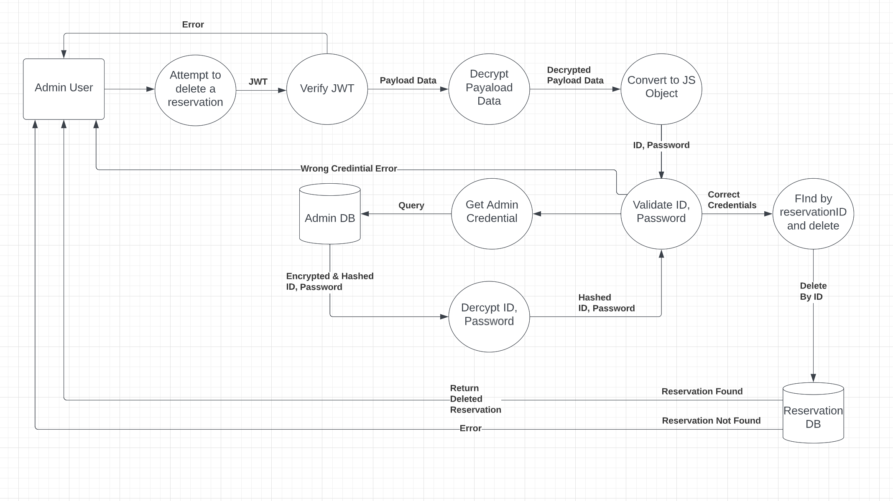

# Restaurant Web Application Project

## Project Introduction <-----Yogida 11>

### Purpose

This project is aimed at developing a restaurant web application that can be beneficial for both customers and the business.

### Functionality / Features

Customers and employees will be able to:

- Book tables.
- Browse menu & price.
- Browse the restaurant's location and contact details.

**Only employees will be able to update, delete and read bookings.**

Employees can :

- Login / Logout admin account.
- View a list of reservations group by selected date in time sequence.
- Identify new booking.
- Search a reservation by the customer's mobile number.
- Update reservations details.
- Delete reservations.

When a booking is requested :

- Automatically calculate the availability based on the provided visiting date, time and number of guests and return corresponding message to the client immediately.
- If there's available table, automatically assign a table that can accommodate the number of guests on the given date and time.
- Alert to the admin user when there's a new booking.

### Target Audience

Potential restaurant's customers and restaurant workers.

### Tech Stack

MERN stack will be used for the development.

Frontend:

- React
- Other Dependencies:
  - react-router-dom, axios, dotenv.

Backend:

- NodeJS
- Express
- MongoDB
- Other Dependencies:
  - helmet, jwtwebtoken, bcrypt, dotenv, cors, mongoose.

---

## User Story

### As a **Visitor**

| Action                                                       | Outcome                                      |
| ------------------------------------------------------------ | -------------------------------------------- |
| View menu with photos                                        | Better understanding of food                 |
| View menu with price                                         | Estimate budget                              |
| View menu with a short description                           | Better understanding of food                 |
| View the restaurant's location                               | Know location of the restaurant              |
| View the restaurant's contact                                | Know contact of the restaurant               |
| View the restaurant's business hour                          | Know the restaurant's business hour          |
| Book tables                                                  | No need to call restaurant.                  |
| Receive booking confirmation after booking                   | Know that booking has been made successfully |
| Receive booking fail message when there's no available table | Know that booking has been failed            |

### As an **Admin**

| Action                                                                                                                          | Outcome                                                                                                                                                    |
| ------------------------------------------------------------------------------------------------------------------------------- | ---------------------------------------------------------------------------------------------------------------------------------------------------------- |
| Log into admin account                                                                                                          | Only admin is accessible to reservation list                                                                                                               |
| Don't want to login frequently                                                                                                  | It's more convenient                                                                                                                                       |
| Receives information of customer's first name, last name, number of visitors, mobile number, date and time for visit on booking | Prepare table accordingly, Guide customers to their seats on arrival Call to customer when necessary                                                       |
| Assign an available table automatically when a booking is made                                                                  | Employee can read the assigned table information with the customer's information and guide them to their reserved table when they arrive to the restaurant |
| Only receives online booking when the number of guest is not bigger than 6                                                      | Minimize risk of no-show, Table can be arranged accordingly by human for a large number of guests                                                          |
| Confirm a new reservation by clicking a 'Confirm' button                                                                        | Identify incoming reservation                                                                                                                              |
| View reservation list group by date by selected date                                                                            | Easier to identify bookings by date                                                                                                                        |
| View reservation list in two groups: unconfirmed and confirmed                                                                  | Identify unconfirmed reservation so the table can be prepared for unconfirmed reservations                                                                 |
| View reservation lists in time sequence (top: earliest entry time, bottom: latest entry time)                                   | Easier to identify guests coming soon                                                                                                                      |
| Search a reservation by customer's mobile number                                                                                | Easy to find a target reservation                                                                                                                          |
| Update all details of the reservations                                                                                          | Accept customers' plan changes                                                                                                                             |
| Cancel (delete) a reservation                                                                                                   | Table can be available for others                                                                                                                          |

---

## DFD

### **Database Structure**

### Table

```js
{
  _id : String,
  tableNumber : Number, // Unique number to identify tables
  seats: Number // Number of seats that a table has
}
```

The table collection represents all tables that a restaurant have.  
The table collection and documents will be pre seeded into the database because they hardly change.  
In this project, we will seed the tables with 2 seats, 4 seats and 6 seats.

### Reservation

```js
{
  _id: String,
  tableId: ObjectId, // From Table document, Populate
  guest: guestSchema, // Sub document
  isConfirmed: Boolean // To identify unconfirmed reservation and confirmed reservation
}
```

The reservation collection represents all successfully made reservations.  
'isConfirmed' field is necessary to identify reservations that have not been checked or prepared by the restaurant workers.  
The 'guest' field will exist as a sub document form and will have the following schema:

```js
{
  firstName : String,
  lastName : String,
  mobile: String, // Mobile number
  date: Date,  // Visiting date inc time
  guestNumber: Number //Number of required seats
}
```

The above schema is the information that potential customers are required to provide on reservation request as well.

### Admin

```js
{
  _id: String,
  id: String, //hashed, encrypted
  password: String //hashed, encrypted
}
```

The Admin collection represents an admin account.  
To read, update and delete the 'Reservation' document, the user must be authenticated by successfully logging in.  
It will have only one pre-seeded document because having multiple admin accounts is meaningless in this case.

### **Customer book a table**


When a customer request a reservation, we will receive these information filled by the customer:

1.  First name
2.  Last name
3.  Mobile number
4.  Date (Inc time)
5.  Number of guest

This information is represented as **'Booking Info'** in this DFD.

And the API will process the data as follows:

1. Get an array of reservations from the Reservation collection that have the same date value with the date provided in the Booking Info (Except the time at this stage for simplicity)
2. Filter the reservation array to get another array of reservations that have similar time from (Booking Info's time - 1h 30min) to (Booking Info's time + 1h 30min) and similar number of seats (same number of table seats with the Booking Info's number of guests or one more number of table seats than the Booking Info's number of guests). This will eventually return an array of unavailable tables that is matched with the provided conditions from the Booking Info.
3. Check if there's any reservation reserved by the same mobile number. This will prevent customers book again accidentally. The reason why we implement this after the process of the number 2 is to allow customers to book again on the different dates or time (lunch/dinner).
4. If the reservation found that has been made by the same customer, return error. Otherwise, get all tables from the 'Table' collections and find a table that is not in the unavailable tables. This will return an available table that satisfies the condition provided from the 'Booking Info'. If there's no available table, return error.
5. If an available table is found, insert the provided booking info with the found available tableId into the 'Reservation' collection.
6. Return the newly created document in the 'Reservation' collection.

### Admin login


The Admin ID and Password will be hashed and encrypted and stored in the 'Admin' collection.  
Therefore, the DFD shows the process of decrypting Admin's credentials from the 'Admin' collection and validate hashed credentials with the provided plain credentials.  
If it's matched, the JWT will be returned.

### **Admin view reservation list**


The jwt will be required when the user requests to read the reservation list.
Some API middleware will validate the JWT and the admin credentials are correct.  
If both of them are valid, it will return the reservation list.  
Otherwise, it will return error.

### **Admin update a reservation**


Same as above, it will validate the JWT and the admin credentials first.  
Then it will check which data is requested to be updated.  
Because if any of the time, date, number of guests or table is requested to be updated, it needs to get an available table that satisfies the condition again.  
Therefore, if any of attempting of changing those values is detected, it will go through the process of finding an available table mentioned in the 'Customer booking DFD'.  
Otherwise, it will update the reservation directly.

### **Admin delete a reservation**



Same as above, it will validate the JWT and the admin credentials first.  
Then it will find the document by its ID from the 'Reservation' collection, and delete it.  
if no matching document is found, it will return an error.

### **Admin search reservation(s) by mobile number**


Same as above, it will validate the JWT and the admin credentials first.  
Searching a specific reservation is a necessary function for the restaurant workers.  
Because when they want to update, delete or read a specific reservation, the target reservation is needed to be found first.  
To prepare for such cases, we have decided to make the restaurant workers to be able to search a reservation or reservations (booked by the same person for multiple times) by the customer's mobile number because the mobile number is unique.  
Therefore, if the mobile number is not found from the 'Reservation' collection, it will return an error.  
If it's found, it will return an array of reservation that have the same mobile number.

---

## Application Architecture Diagram

<br>


This application consists of three different layers such as the Front-end layer, the Back-end layer, and database layer.

### **Front-end layer**

The `front-end server` can communicate with the `backend server` via `HTTP Request`. The application can be operated through a browser, and the data changed and generated through the event of the application is stored in the database through the backend.
The frontend of this application consists of four main components and components of Header and Footer.

#### **MenuList**

This component represents the menu list that the restaurant has. It include meals that the shop provides and each price of the meal.

#### **Booking**

This component determines whether the customer is already registered and shows its information if registered.
In case of a new customer, the customer can register his/her details and make a reservation at the date and time he/she want. The component can also change the reservation date and time and the number of people. It can also cancel the reservation if he/she don't want to.

#### **AboutUs**

This component has information of the restaurant such as the location, opening hours, and its address.

#### **Admin**

This component is logged in by the Admin to confirm and approve the reservation. And if there is a request for modification or deletion from a customer, reservation modification and deletion can be made.

### **Back-end layer**

The Back-end server communicates with the database depending on the request and retrieves the corresponding data to fulfill the request. This front-end request queries the Mongoose to manipulate the desired data. Once receives data from MongoDB, backend will send API response back to the frontend. The backend server manipulates data into mongoDB through APIs for inserting, updating, and deleting data.

### **Database layer**

Data is kept in DB so that uses can retrieve the data they want or update and delete the data.

---

## WireFrame

<br>

`Wireframe` is simplified, low-fidelity representations of a user interface that are used to demonstrate the structure and layout of a website or application. A rough sketch of the designer's idea of the application is used to share his/her thoughts with the relevant stackholder and developers. We use the `agile methodology` to efficiently complete this wireframe, allowing for immediate reflection of user requirements changes and better ideas.

### **The first draft**


After the first meeting of our project team, we drafted the wireframe as above. It consists of a `home page` that can be viewed when a user accesses this application, a `reservation page` that can make a reservation, and an `about us page` that indicates the location and business hours of a restaurant.

#### **Set items in Navbar**

The Navbar has `Menu`, `Reservation`, and `AboutUs` items. It can be moved to corresponding page when clicking on. On the left side of Navbar, a `restaurant logo` is placed so that when clicked, we can move to Home page.

#### **Who handles the application?**

The issue that arose during the first meeting was who would handle this application. I said that the restaurant owner, not the customer, is for reservation management, and Jihyuk, a team member, suggested that the customer make reservations himself and the restaurant owner should manage it. The latter seemed more realistic, so we decided to implement this way.

#### **Implementing changes**

An `Admin` item was added to navbar. The `booking list` on the reservation page of the draft was moved to the `Admin page` to confirm the reservation by the admin. On the reservation page, in order for customers to conveniently register when making a reservation, they searched their mobile number and if it is already registered, the existing their information is displayed. In the case of a new customer, they would register their reservation information. The contents of this change are as follows.


우리는 아이디어를 내면 그것에 대한 장단점과 구현 시 문제점들에 대해서 토론하였고, 초안 wireframe에 적용해 보고, 이 과정을 완성할 때까지 반복하였다.
