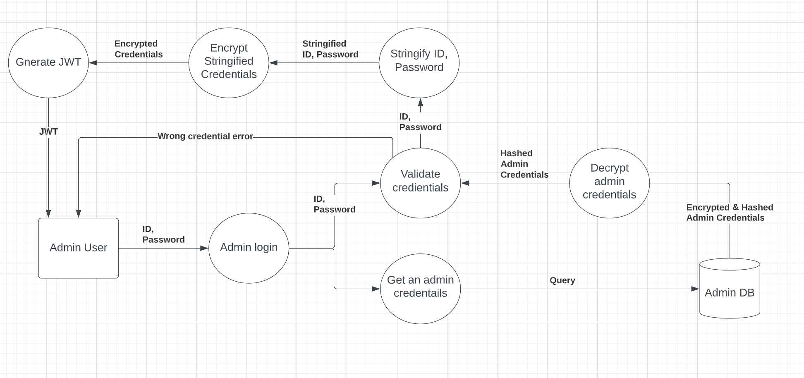

# Restaurant Web Application Project

## Project Introduction

### Purpose

This project is aimed at developing a restaurant web application that can be beneficial for both customers and the business.

### Functionality / Features

Customers and employees will be able to:

1. Book tables.
2. Browse menu & price.
3. Browse the restaurant's location and contact details.

**Only employees will be able to update, cancel, read bookings.**

### Target Audience

Potential restaurant's customers and restaurant workers.

### Tech Stack

MERN stack will be used for the development.  

Frontend:  

- React
- Other Dependencies:
  - react-router-dom, axios, dotenv.

Backend:

- NodeJS
- Express
- MongoDB
- Other Dependencies:
  - helmet, jwtwebtoken, bcrypt, dotenv, cors, mongoose.

---

## User Story

### As a **Visitor**
  
| Action | Outcome |  
| ------ | ------ |
| View menu with photos | Better understanding of food |
| View menu with price | Estimate budget |
| View menu with a short description | Better understanding of food |
| View the restaurant's location | Know location of the restaurant |
| View the restaurant's contact | Know contact of the restaurant |
| View the restaurant's business hour | Know the restaurant's business hour |
| Book tables | No need to call restaurant. |
| Receive booking confirmation after booking | Know that booking has been made successfully |
| Receive booking fail message when there's no available table | Know that booking has been failed |

### As an **Admin**

| Action | Outcome |  
| ------ | ------ |
| Log into admin account | Only admin is accessible to reservation list |
| Receives information of customer's first name, last name, number of visitors, mobile number, date and time for visit on booking | Prepare table accordingly, Call to customer, Guide customers to their seats on arrival |
| Confirm a new reservation by clicking a 'Confirm' button | Identify incoming reservation |
| View reservation list group by date by selecting a date | Easier to identify bookings by date |
| View reservation list in two groups: unconfirmed and confirmed | Identify unconfirmed reservation so the table can be prepared for unconfirmed reservations |
| View reservation lists in time sequence (top: earliest entry time, bottom: latest entry time) | Easier to identify guests coming soon |
| Search a reservation by customer's name and phone number | Easy to find a reservation |
| Update reservation details | Accept customers' plan changes |
| Cancel (delete) a reservation | Table can be available for others |

---

## DFD

### **Database Structure**

### Table

```js
{
  _id : String,
  tableNumber : Number, // Unique number to identify tables
  seats: Number // Number of seats that a table has
}
```

The table collection represents all tables that a restaurant have.  
The table collection and documents will be pre seeded into the database because they hardly change.  
In this project, we will seed the tables with 2 seats, 4 seats and 6 seats.

### Reservation

```js
{
  _id: String,
  tableId: ObjectId, // From Table document, Populate
  guest: guestSchema // Sub document
  isConfirmed: Boolean // To identify unconfirmed reservation and confirmed reservation
}
```

The reservation collection represents all successfully made reservations.  
The 'guest' field will exist as a sub document form and will have the following schema:

```js
{
  firstName : String,
  lastName : String,
  mobile: String, // Mobile number
  date: Date,  // Visiting date inc time
  guestNumber: Number //Number of required seats
}
```

The above schema is the information that potential customers are required to provide on reservation request.

### Admin

```js
{
  id: String //hashed, encrypted
  password: String //hashed, encrypted
}
```

The Admin collection represents an admin account.  
To read, update and delete the 'Reservation' document, the user must be authenticated by successfully logging in.  
It will have only one pre-seeded document because having multiple admin accounts is meaningless in this case.

### **Customer book a table**


When a customer request a reservation, we will receive these information filled by the customer:

 1. First name
 2. Last name
 3. Mobile number
 4. Date (Inc time)
 5. Number of guest

This information is represented as **'Booking Info'** in this DFD.

And the API will process the data as follows:

1. Get an array of reservations from the Reservation collection that have the same date value with the date provided in the Booking Info (Except the time at this stage for simplicity)
2. Filter the reservation array to get another array of reservations that have similar time from (Booking Info's time - 1h 30min) to (Booking Info's time + 1h 30min) and similar number of seats (same number of table seats with the Booking Info's number of guests or one more number of table seats than the Booking Info's number of guests). This will eventually return an array of unavailable tables that is matched with the provided conditions from the Booking Info.
3. Check if there's any reservation reserved by the same mobile number. This will prevent customers book again accidentally. The reason why we implement this after the process of the number 2 is to allow customers to book again on the different dates or time (lunch/dinner).
4. If the reservation found that has been made by the same customer, return error. Otherwise, get all tables from the 'Table' collections and filter to get a table that is not in the unavailable tables. This will return an available table that satisfies the condition provided from the 'Booking Info'.
5. Insert booking info and tableId into the 'Reservation' collection.
6. Return the newly created document in the 'Reservation' collection.

### Admin login



The Admin ID and Password will be hashed and encrypted and stored in the 'Admin' collection.  
Therefore, the DFD shows the process of decrypting Admin's credentials from the 'Admin' collection and validate hashed credentials with the provided plain credentials.  
If it's matched, the JWT will be returned.

### **Admin view reservation list**


The jwt will be required when the user requests to read the reservation list.
Some API middleware will validate the JWT and the admin credentials are correct.  
If both of them are valid, it will return the reservation list.  
Otherwise, it will return error.

### **Admin update a reservation**


Same as above, it will validate the JWT and the admin credentials first.  
Then it will check which data is requested to be updated.  
Because if any of the time, date, number of guests or table is requested to be updated, it needs to get an available table that satisfies the condition again.  
Therefore, if any of attempting of changing those values is detected, it will go through the process of finding an available table mentioned in the 'Customer booking DFD'.  
Otherwise, it will update the reservation directly.

### **Admin delete a reservation**


Same as above, it will validate the JWT and the admin credentials first.  
Then it will find the document by its ID from the 'Reservation' collection, and delete it.  
if no matching document is found, it will return an error.

### **Admin search reservation(s) by mobile number**


Same as above, it will validate the JWT and the admin credentials first.  
Searching a specific reservation is a necessary function for the restaurant workers.  
Because when they want to update, delete or read a specific reservation, the target reservation is needed to be found first.  
To prepare for such cases, we have decided to make the restaurant workers to be able to search a reservation or reservations (booked by the same person for multiple times) by the customer's mobile number because the mobile number is unique.  
Therefore, if the mobile number is not found from the 'Reservation' collection, it will return an error.  
If it's found, it will return an array of reservation that have the same mobile number.
