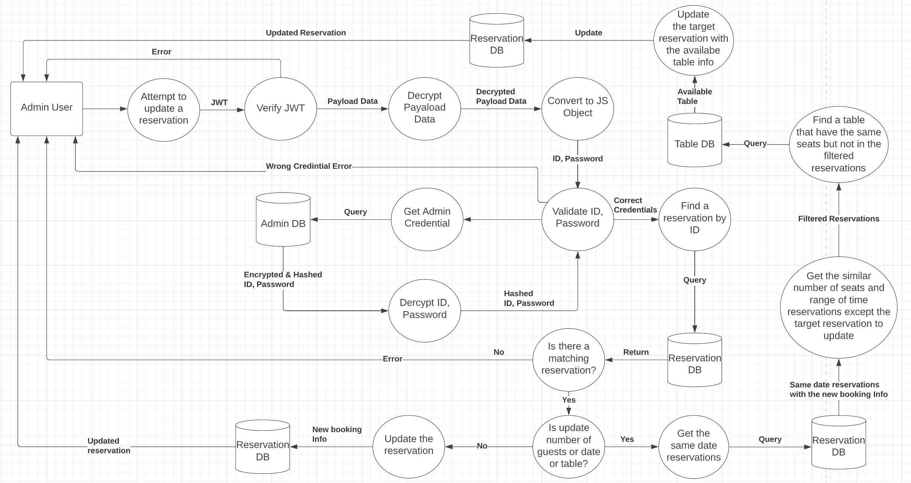

# Restaurant Web Application Project

## Project Introduction

### Purpose

This project is aimed at developing a restaurant web application that can be beneficial for both customers and the business.

### Functionality / Features

Customers and employees will be able to:

1. Book tables.
2. Browse menu & price.
3. Browse the restaurant's location and contact details.

**Only employees will be able to update, cancel, read bookings.**

### Target Audience

Potential restaurant's customers and restaurant workers.

### Tech Stack

MERN stack will be used for the development.  

Frontend:  

- React
- Other Dependencies:
  - react-router-dom, axios, dotenv.

Backend:

- NodeJS
- Express
- MongoDB
- Other Dependencies:
  - helmet, jwtwebtoken, bcrypt, dotenv, cors, mongoose.

---

## User Story

### As a **Visitor**
  
| Action | Outcome |  
| ------ | ------ |
| View menu with photos | Better understanding of food |
| View menu with price | Estimate budget |
| View menu with a short description | Better understanding of food |
| View the restaurant's location | Know location of the restaurant |
| View the restaurant's contact | Know contact of the restaurant |
| View the restaurant's business hour | Know the restaurant's business hour |
| Book tables | No need to call restaurant. |
| Receive booking confirmation after booking | Know that booking has been made successfully |
| Receive booking fail message when there's no available table | Know that booking has been failed |

### As an **Admin**

| Action | Outcome |  
| ------ | ------ |
| Log into admin account | Only admin is accessible to reservation list |
| Receives information of customer's first name, last name, number of visitors, mobile number, date and time for visit on booking | Prepare table accordingly, Call to customer, Guide customers to their seats on arrival |
| Confirm a new reservation by clicking a 'Confirm' button | Identify incoming reservation |
| View reservation list group by date by selecting a date | Easier to identify bookings by date |
| View reservation list in two groups: unconfirmed and confirmed | Identify unconfirmed reservation so the table can be prepared for unconfirmed reservations |
| View reservation lists in time sequence (top: earliest entry time, bottom: latest entry time) | Easier to identify guests coming soon |
| Search a reservation by customer's name and phone number | Easy to find a reservation |
| Update reservation details | Accept customers' plan changes |
| Cancel (delete) a reservation | Table can be available for others |

---

## DFD

### Customer booking a table

### Admin login

### Admin view reservation list

### Admin update a reservation

### Admin delete a reservation

